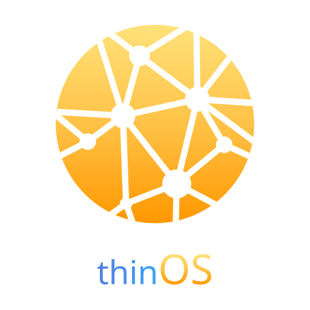

# thinOS

## Description
thinOS is a lightweight, cross-platform desktop operating system designed for efficiency and simplicity. It provides a minimalistic environment optimized for performance, making it ideal for users who require a fast and responsive system without unnecessary bloat. thinOS is built with modern technologies to ensure compatibility with a wide range of hardware while maintaining a sleek user interface.

## Features
  - **Lightweight Design**: thinOS is optimized for speed and efficiency, ensuring quick boot times and low resource consumption.
  - **Cross-Platform Compatibility**: Designed to run on various hardware architectures, thinOS supports a wide range of devices.
  - **User-Friendly Interface**: The operating system features a clean and intuitive user interface, making it easy for users to navigate and manage their system.
  - **Customizable Environment**: Users can tailor their thinOS experience with various themes, extensions, and configurations.
  - **Robust Security**: thinOS includes built-in security features to protect user data and maintain system integrity.

## License
This software is distributed under the [GPLv3](LICENSE) license.

## Security
Please disclose any vulnerabilities found responsibly – report security issues to the maintainers privately. See [SECURITY.md](SECURITY.md) for more information.

## Contributing
Contributions to thinOS are welcome! If you have ideas for new features or have found bugs, please open an issue or submit a pull request.

### How to Contribute
  - **Fork the Repository**: Create a fork of the repository on GitHub.
  - **Create a New Branch**: For new features or bug fixes, create a new branch in your fork.
  - **Submit a Pull Request**: Once your changes are ready, submit a pull request to the main repository.
## Wait, where is the documentation?
Review the [Documentation](https://laswitchtech.com/en/blog/projects/thinos/index).
